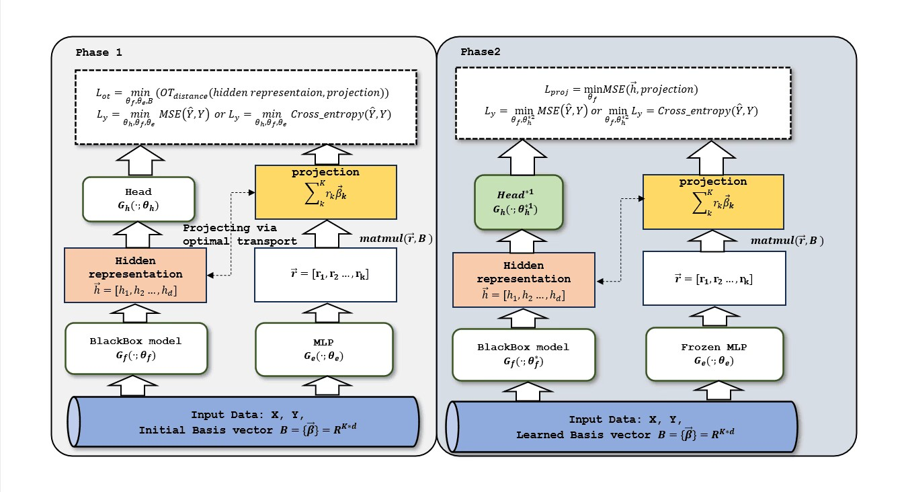
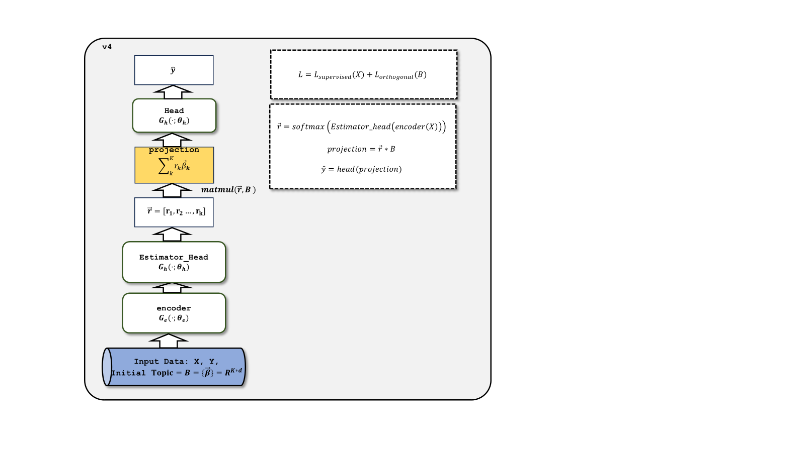

# experimental records
## 数据集
|dataname|n_num_features|n_cat_feature|tasktype|train_size|
|-|-|-|-|-|
|abalone|7|1|regression|2506|
|airfoil_self_noise|5|0|regression|961|
|Brazilian_houses|8|4|regression|6415|
|california_housing|8|0|regression|13209|
|colleges|33|14|regression|4237|
|combined_cycle_power_plant|4|0|regression|6123|
|concrete_compressive_strength|8|0|regression|659|
|diamonds|6|3|regression|32364|
|elevators|18|0|regression|9959|
|House_16H|16|0|regression|13670|
|house_sales|21|1|regression|12967|
|OnlineNewPopularity|58|0|regression|23786|
|physicochemical_properties_of_protein_tertiary_structure|9|0|regression|29267|
|pol|48|0|regression|9000|
|qsar_aquatic_toxicity|8|0|regression|349|
|qsar_fish_toxicity|6|0|regression|581|
|superconductivty_data|81|0|regression|13608|
|yacht_hydrodynamics|6|0|regression|197|
|adult|6|8|binclass|26048|
|Click prediction small|11|0|binclass|23968|
|higgs_small|28|0|binclass|62752|
|wilt|5|0|binclass|2903|
|aloi|128|0|multiclass:1000|69120|
|helena|27|0|multiclass:100|41724|
|jannis|54|0|multiclass:4|53588|

## v1
(参数初始化不公平)

### 默认参数结果
1. [回归数据集结果](./v1/results_standard_version/regression.xlsx)
2. [分类数据集结果](./v1/results_standard_version/classification.xlsx)
3. [系数r的可视化](./v1/results_standard_version/heatmap_standard_R/)
4. [phase1中distance matric可视化](./v1/results_standard_version/heatmap_standard_phase1_DistMap/)
5. [hidden representaion可视化](./v1/results_standard_version/tsne_hid/):分别对phase1模型输出的hidden representaion,phase2模型输出的hidden representaion，以及$\sum{r_k\beta_k}$使用t-sne可视化
6. 数据记录以及可视化
[可视化数据(phase1的hidden representaion,topic,distance matrix)](./v1/results_standard_version/data_visuliztion_standard/)
### 随机生成topics
原本设置:使用kmeans对输入样本聚类，使用聚类中心初始化topics
当前实验设置:使用随机数随机生成topics
1. [回归数据集结果](./v1/results_randomly_initialized_topics/regression.xlsx)
2. [分类数据集结果](./v1/results_randomly_initialized_topics/classification.xlsx)
3. [系数r的可视化](./v1/results_randomly_initialized_topics/heatmap_random_R/)
### 第一阶段使用mse
原本设置:phase1阶段$min(OT_{distance}(\vec{h},\sum{r_k\beta_k}))$(batch层次) 
当前实验设置:phase1阶段$min(MSE(\vec{h},\sum{r_k\beta_k}))$ 
1. [回归数据集结果](./v1/results_mse_in_phase1/regression.xlsx)
2. [分类数据集结果](./v1/results_mse_in_phase1/classification.xlsx)
3. [系数r的可视化](./v1/results_mse_in_phase1/heatmap_mse_in_phase1/)
### 第二阶段使用ot
原本设置:phase2阶段$$min(MSE(\vec{h},\sum{r_k\beta_k}))$$ 
当前实验设置:phase2阶段$$min(OT_{distance}(\vec{h},\sum{r_k\beta_k}))$$(batch层次) 
1. [回归数据集结果](./v1/results_ot_in_phase2/regression.xlsx)
2. [分类数据集结果](./v1/results_ot_in_phase2/classification.xlsx)
### 第一阶段使用mse与第二阶段使用ot结果比较
1. [回归数据集结果](./v1/result_mse_ot_compare/regression.xlsx)
2. [分类数据集结果](./v1/result_mse_ot_compare/classification.xlsx)
### 减小第一阶段的patience
原本设置:phase1的patience=16 
当前实验设置:phase1的patience=6 
1. [回归数据集结果](./v1/results_half_patience_in_phase1/regression.xlsx)
2. [分类数据集结果](./v1/results_half_patience_in_phase1/classification.xlsx)
### 将数据集改为平衡数据集
结果分别为在1. 在不平衡测试集上测试，2. 在平衡测试集上测试 
1. [数据集结果](./v1/results_balanced_dataset/classification.xlsx)
### 数据预处理之前使用kmeans聚类生成聚类中心，映射至高维作为初始topic
原本设置:先对训练集预处理，然后使用kmeans聚类，在将聚类中心映射至高维初始化topic 
当前实验设置:不经过预处理直接对训练集使用kmeans聚类，在将聚类中心映射至高维初始化topic，再预处理训练集 
1. [回归数据集结果](./v1/results_kmeans_before_preprocessing/regression.xlsx)
2. [分类数据集结果](./v1/results_kmeans_before_preprocessing/classification.xlsx)
## v1+
(v1 参数初始化公平的版本)
1. [standard version回归数据集](./v1+/standard/regression.xlsx)
2. [standard version分类数据集](./v1+/standard/classification.xlsx)
3. [两阶段都使用mse,回归数据集](./v1+/mse/regression.xlsx)
## v2
(phase1只使用estimator预测y，estimator为MLP) 
一阶段只使用estimator 
(参数初始化不公平) 
### 使用MSE对齐hidden representaion与projection
1. [回归数据集结果](./v2/results_MSE/regression.xlsx)
2. [分类数据集结果](./v2/results_MSE/classification.xlsx)
### 使用OT对齐hidden representaion与projection
1. [回归数据集结果](./v2/results_OT/regression.xlsx)
2. [分类数据集结果](./v2/results_OT/classification.xlsx)
### 将projection作为pseodu_label结果
1. [回归数据集结果](./v2/results_pesudo_label/regression.xlsx)
2. [分类数据集结果](./v2/results_pesudo_label/classification.xlsx)
## v3
(v2基础上phase1的estimator结构与phase2结构相同) 
(参数初始化不公平) 
### 将projection作为pseodu_label结果(v3)
1. [回归数据集结果](./v3/pseudo_label/regression.xlsx)
2. [分类数据集结果](./v3/pseudo_label/classification.xlsx)
3. [数据记录以及可视化](./v3/pseudo_label/data_visulization/):包含第一阶段的隐藏层hid，预测系数r的隐藏层R_hid，系数r,topic的cos相似度矩阵以及topic 
# all data
1. [回归数据集结果](./all_data/all_regression.xlsx)
2. [分类数据集结果](./all_data/all_classification.xlsx)
3. [实验详细介绍](./all_data/介绍.md)
# ------------------------------------------------------------------------
两阶段改为一阶段
## v4
将v1,v2,v3的两阶段改为一阶段

### v4结果
1. [结果](./v4/v4_standard/v4_regression.xlsx)
2. [missing value场景](./v4/v4_standard/v4_missing_value_regression.xlsx)
3. [few sample场景](./v4/v4_standard/v4_few_sample_regression.xlsx)
4. [topic使用不同方差的正态分布初始化](./v4/v4_standard/v4_initial_std_regression.xlsx)
5. [使用带temper的softmax](./v4/v4_standard/v4_softmax_temper_regression.xlsx)
6. [改变topic num实验结果(california_housing)](./v4/v4_standard/v4_topics_num_california_housing_regression.xlsx)
### v4结果2
1. [使用不同方式进行kmeans聚类初始化topic](./v4/v4_standard/kmeans/)
2. [random初始化，topic不正交](./v4/v4_standard/orthogonal)
3. [random初始化topic时改变方差-(先random初始化，后GaussianProjection)](./v4/v4_standard/std_random-w-gaussianProj/)
4. [random初始化topic时改变方差-(不使用GaussianProjection)](./v4/v4_standard/std_random-wo-gaussianProj/)
### v4结果3
1. [random初始化topic时改变方差-(不使用GaussianProjection)(分类数据集)](./v4/v4_standard/std_random-wo-gaussianProj/random_init_wo_gaussianProj_classification.xlsx)
2. [数据集sample的std,distance correlation等信息](./v4/v4_standard/sample_info_of_dataset/dataset_info.xlsx)
## v5
将v4改为两阶段形式，第一阶段训练baseline,第二阶段固定baseline的encoder训练topic, estimator_head，和hea
### v5结果
1. [回归数据集结果(topic random 初始化，std=1.0)，与v4(random初始化，std=1.0)对比](./v5/v5_regression.xlsx)
### v5主要实验
1. [正交实验(topic正交)](./v5/main_exp/v5_orthogonal/v5_regression_orthogonal_weight.xlsx)
2. [少量样本实验(按照一定ratio采样样本)](./v5/main_exp/v5_few_sample/v5_regression_few_sample.xlsx)
3. [feature缺失实验(随机mask掉部分feature)](./v5/main_exp/v5_missing_value/v5_regression_missing_value.xlsx)

### v5其他实验
1. [aloi数据集不同prototype num结果](./v5/other_exp/classification_aloi.xlsx)
2. [二分类数据集不同prototype num结果](./v5/other_exp/classification_binary_classification.xlsx)

#2023/2/26 update
# ------

# ------
2023/2/19 update
[加入v5版本的其他实验(topic正交、随机采样部分样本、随机mask掉部分feature-value)](#v5其他实验)
# ------
2023/1/31 update
[v5版本结果：将v4改为两阶段形式，第一阶段训练baseline,第二阶段固定baseline的encoder训练topic, estimator_head，和head](#v5结果)
# ------
2024/1/30 update
[random初始化topic时改变方差-(不使用GaussianProjection)(分类数据集)](./v4/v4_standard/std_random-wo-gaussianProj/random_init_wo_gaussianProj_classification.xlsx) 
[数据集sample的std,distance correlation等信息](./v4/v4_standard/sample_info_of_dataset/dataset_info.xlsx) 
# ------
2024/1/29 update
[添加v4版本改变kmeans方式，random情况下不正交，改变random方差的实验](#v4结果2)
# ------
2024/1/27 update
[添加v4版本对于california_housing改变topic num的实验结果](#v4)
# ------
2024/1/26 update
[添加v4版本](#v4)
# ------
2024/1/24 update
[添加v1版本模型初始化公平时的结果v1+](#v1-1)
# ------
2024/1/23 update 
[所有数据同一张表结果](#all-data)
添加了所有实验数据整合到一张表内的结果 
# ------
2024/1/22 update 
[v3-将projection作为pseodu_label结果](#将projection作为pseodu_label结果v3)
实验结构:v2基础上，phase1的estimator结构与phase2结构相同 
实验数据：将phase的r*topic作为phase2的pseudo label的实验结果 
# ------
2024/1/21 update 
[v2](#v2) 
[v1中第一阶段使用mse与第二阶段使用ot结果比较](#第一阶段使用mse与第二阶段使用ot结果比较) 
[v1中标准方法(phase1 ot,phase2 mse)phase1数据记录(hidden representaion,topic,distance_matrix):v1-默认参数结果-6](#默认参数结果) 
   
