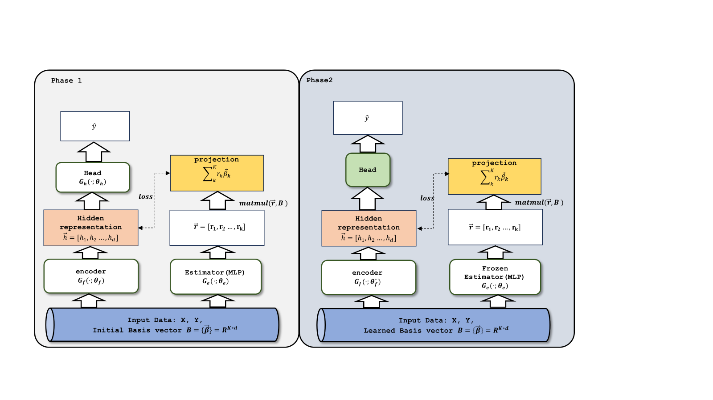
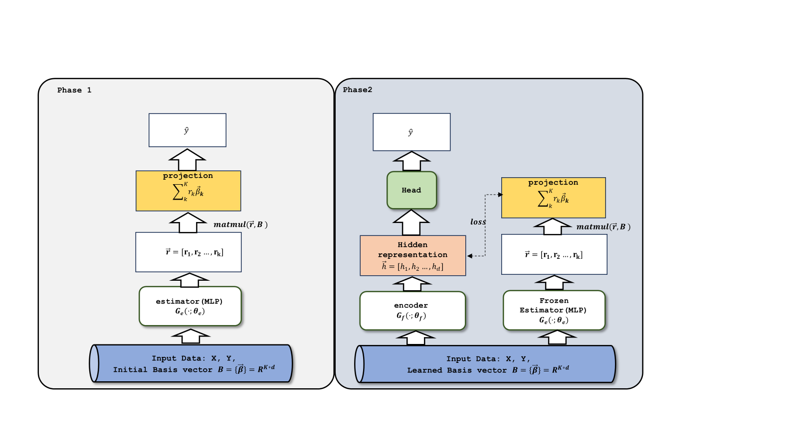

# v1

## v1:standard version(topics are initialized by kmeans)
1. phase1使用encoder(BalckBox Model)输出的hidden representaion与$r*topic$计算ot loss
2. phase2使用encoder(BalckBox Model)输出hidden representaion与$r*topic$计算MSE loss
3. topic初始化使用kmeans聚类的类中心
## v1:topics are initilized randomly	
1. topic初始化使用随机值			
## v1:use half patience in phase 1 (half_patience is 8)				
1. 将phase1的patience减小为原来的一半(16减小到8)
## v1:use mse loss in phase1				
1. phase1使用encoder(BalckBox Model)输出hidden representaion与$r*topic$计算MSE loss
## v1:use ot loss in phase2		
1. phase2使用encoder(BalckBox Model)输出hidden representaion与$r*topic$计算ot loss		
# v2

phase1直接用r*topic作为hidden representaion，用以预测y。estimator选择MLP
## v2：use mse loss in phase2		
1. phase2使用encoder(BalckBox Model)输出的hidden representaion与$r*topic$计算MSE loss
## v2：use ot loss in phase2
1. phase2使用encoder(BalckBox Model)输出的hidden representaion与$r*topic$计算OT loss				
## v2:use projection as pseudo label
1. phase2使用encoder(BalckBox Model)输出的hidden representaion预测$r*topic$,(将$r*topic$视为pseudo label)					
# v3

phase1直接用r*topic作为hidden representaion，用以预测y。预测系数r的estimator选择与encoder(BalckBox Model)一样的结构
## v3:use projection as pseudo label
1. phase2使用encoder(BalckBox Model)输出的hidden representaion预测$r*topic$,(将$r*topic$视为pseudo label)		
	